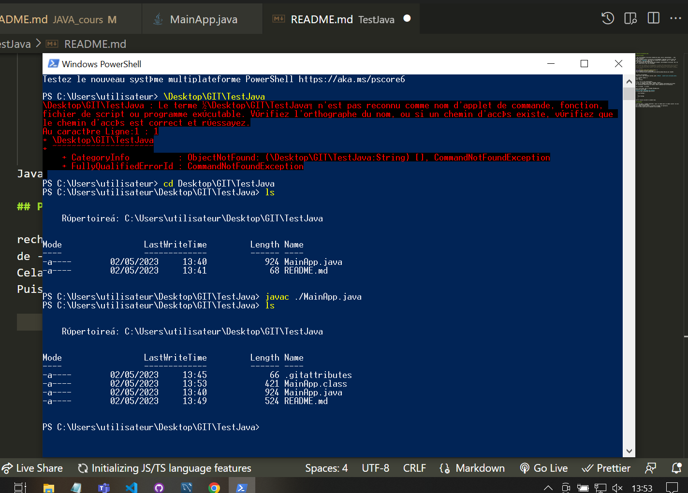
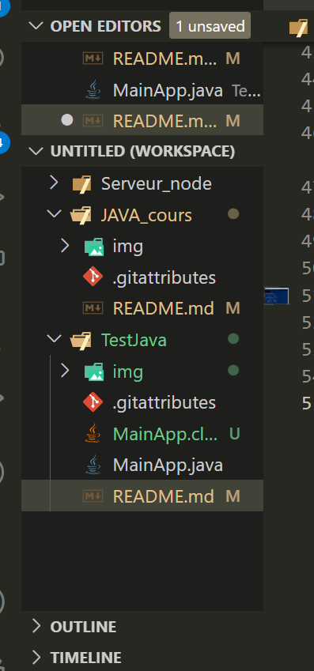
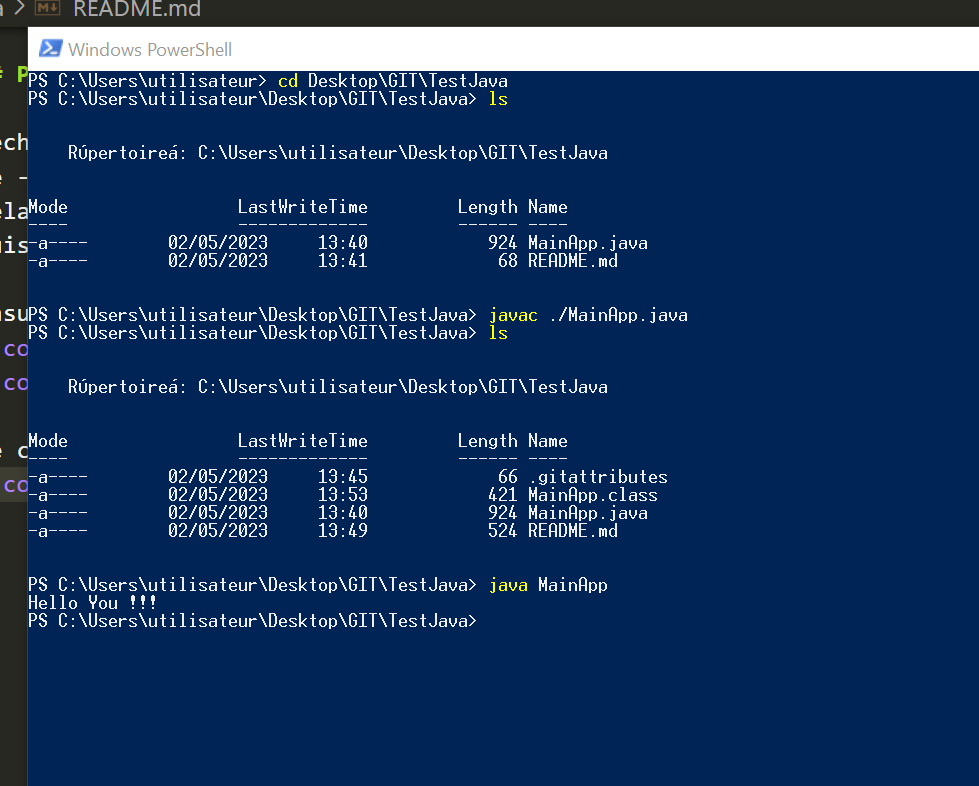

# Exercice découverte Java

Dans cet exercice nous allons découvrir Java, la classe Main.
Nous allons installer l'environnement de travail via JDK, les variables d'envirronement...
Utiliser PowerShell pour compiler et exécuter le code.

## Mise en place

- JSE: environnement d'exécution standard de jJava, outils, bibliothèques...  Java Standard Edition.
- JDK: Ensemble d'outils nécessaires au développement (regroupe le JSE et outils de compilation (**javac**), JRE, outil de création jar: extension .jar = ). Pour les développeurs. Java Development Kit.
- JRE: plateforme Java, Java Runtime Envirronement, environnement d'exécution. Pour les user d'application, sans les développer.

[Java SE](https://www.oracle.com/fr/java/) ->
JDK Development Kit 20.0.1 downloads: 	
[jdk install](https://download.oracle.com/java/20/latest/jdk-20_windows-x64_bin.exe) (sha256)

Variables environnement: 
chemin javac, dans variables système, path. **Penser à ajouter après bin\javac.exe**.

Dans commande (wndows r):
javac.exe
java -version

En JS, l'on a vu les constructeurs.
En Java, on utilisera les objets, méthodes, classes ...
Java est un langage orienté objet, chacun de nos fichiers représentera une classe.
Les conventions veulent que les classes, objets commencent par une majuscule.

Main correspond à la classe.

Ouvrir bloc-notes, puis le renommer MainApp.java.
Ouverture via VS Code.
**Notre fichier représente une classe**.
Il existe deux conventions avec les {}:

    class MainApp {
        
    }
    class MainApp 
    {

    }
Java va toujours exécuter le premier main.

## PowerShell

Recherche power -> windows powershell, saisir le chemin après le chemin courant :cd suivi de ->  Desktop\GIT\TestJava.
Cela change le chemin courant (cd permet de changer le répertoire).
Puis ls entrée pour avoir le dossier et son contenu.

Ensuite, saisie de javac ./MainApp.java pour compiler le code.

    

 java MainApp

Compiler toute l'appli: dans dossier => javac *.java

## Chat.java et Chien.java

Construction de classes, constructeur.
Mot clef this.

Dans App: création instance de chat.

Getter/setter
Utilisation des classes et instances de classes dans appli.
